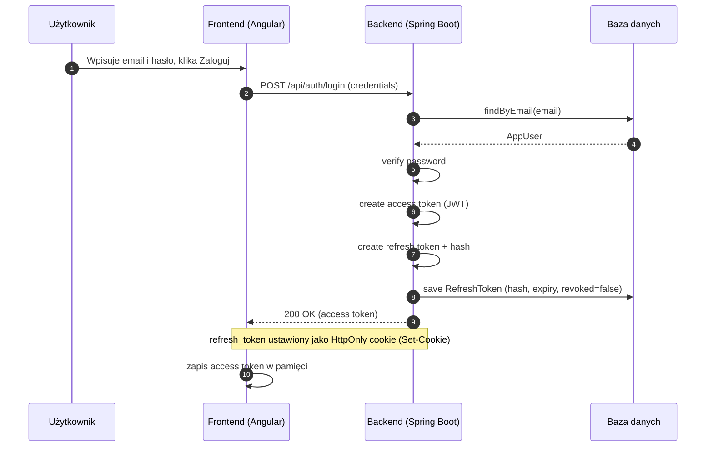
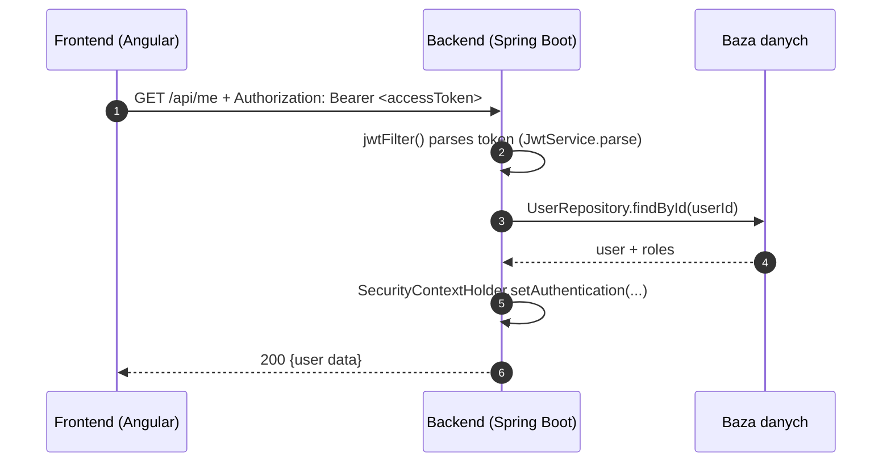
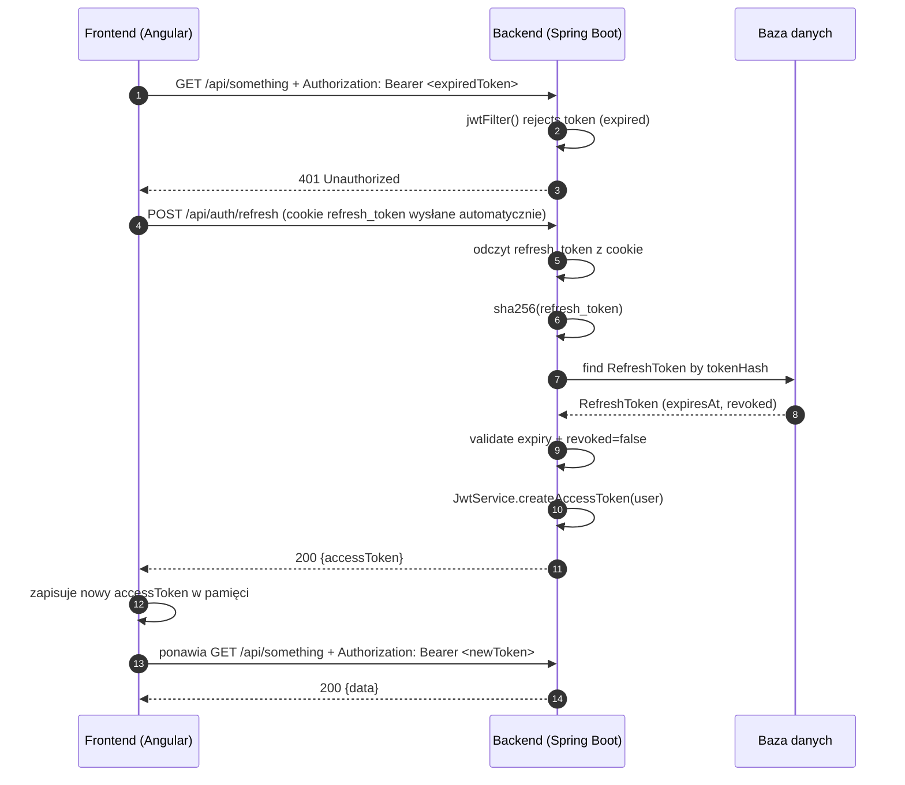

# Konspekt działania aplikacji (Spring Boot + Angular)

> Model autoryzacji: **JWT Access Token w pamięci (frontend)** + **Refresh Token w HttpOnly cookie (przeglądarka)**  
> Cel: krótko żyjący access token do autoryzacji requestów + dłużej żyjący refresh token do “cichego” odświeżania sesji.

---

## 1. Architektura na wysokim poziomie

### Backend (Spring Boot)
- Udostępnia REST API pod `/api/**`
- Chroni zasoby przez Spring Security
- Weryfikuje **JWT access token** z nagłówka `Authorization`
- Obsługuje **refresh** przez endpoint `/api/auth/refresh` i cookie `refresh_token` (HttpOnly)
- Trzyma refresh tokeny w bazie (hash + expiry + revoked) — możliwość unieważniania sesji

### Frontend (Angular)
- Renderuje UI, komunikuje się z backendem przez HTTP
- Trzyma **access token wyłącznie w pamięci** (np. `BehaviorSubject`)
- `HttpInterceptor` dokleja `Authorization: Bearer <accessToken>`
- Po `401` uruchamia **silent refresh** i ponawia request

---

## 2. Kluczowe elementy i ich rola

## 2.1 Backend

### `SecurityConfig`
- Ustawia reguły dostępu (np. `/api/auth/**` publiczne, `/api/admin/**` dla ADMIN, reszta wymaga zalogowania)
- Rejestruje filtr `jwtFilter()` przed `UsernamePasswordAuthenticationFilter`
- Konfiguruje stateless session (`SessionCreationPolicy.STATELESS`)

### `jwtFilter()`
- Czyta `Authorization: Bearer <jwt>`
- Weryfikuje token przez `JwtService.parse()`
- Pobiera usera z DB (`UserRepository`)
- Mapuje role na `GrantedAuthority`
- Ustawia `SecurityContextHolder` (request staje się “zalogowany”)

### `JwtService`
- Generuje access token (`createAccessToken`)
- Parsuje i weryfikuje token (`parse`) — podpis, issuer, expiration

### `AuthService`
- `login`: weryfikuje hasło, wydaje access token, ustawia refresh cookie, zapisuje hash refresh tokena w DB
- `refresh`: czyta refresh token z cookie, sprawdza hash w DB, wydaje nowy access token
- `logout`: unieważnia refresh token w DB i czyści cookie

### `RefreshToken` + `RefreshTokenRepository`
- Encja i repozytorium do przechowywania refresh tokenów po stronie serwera:
    - `tokenHash` (hash surowego tokena)
    - `expiresAt`
    - `revoked`

### `ApiExceptionHandler`
- Standaryzuje błędy (ProblemDetail), np. `401 Unauthorized`, `400 Validation error`

---

## 2.2 Frontend

### `AuthService` (Angular)
- Trzyma access token w pamięci (`BehaviorSubject`)
- `login()` zapisuje access token
- `silentRefresh()`/`refresh()` pobiera nowy access token (cookie idzie automatycznie, jeśli `withCredentials: true`)
- `logout()` czyści token i woła backend

### `authInterceptor`
- Dla requestów poza `/api/auth/**` dodaje nagłówek `Authorization`
- Gdy backend zwróci `401`:
    - uruchamia refresh
    - po sukcesie ponawia pierwotny request z nowym tokenem

### `withCredentials: true`
- Krytyczne dla refresh cookie:
    - bez tego przeglądarka **nie wyśle cookie** do `/api/auth/refresh`

---

## 3. Przepływy informacji (end-to-end)

## 3.1 Logowanie
- Frontend wysyła `POST /api/auth/login` z `{email, password}`
- Backend:
    - sprawdza usera i hasło
    - generuje access token (JWT) i odsyła go w body
    - generuje refresh token:
        - surowy token trafia do `Set-Cookie` jako HttpOnly cookie
        - hash tokena trafia do DB
- Frontend zapisuje access token w pamięci

## 3.2 Request do chronionego API
- Frontend woła endpoint (np. `/api/me`)
- Interceptor dodaje `Authorization: Bearer <accessToken>`
- Backend w `jwtFilter()` weryfikuje token i wpuszcza request

## 3.3 Wygaśnięcie access tokena i silent refresh
- Request wraca `401`
- Interceptor wywołuje `/api/auth/refresh` (z cookie)
- Backend sprawdza refresh token (hash + expiry + revoked) i wydaje nowy access token
- Frontend zapisuje nowy token i ponawia pierwotny request

## 3.4 Logout
- Frontend woła `/api/auth/logout`
- Backend unieważnia refresh token w DB i czyści cookie
- Frontend czyści access token w pamięci

---

## 4. Diagramy sekwencji (Mermaid)

> Wymaga podglądu Mermaid (np. GitHub, GitLab, niektóre IDE, wtyczki do VS Code).

### 4.1 Logowanie (login)



### 4.2 Chroniony request (happy path)



### 4.3 Wygaśnięcie access tokena i silent refresh



### 4.4 Logout

```mermaid
sequenceDiagram
  autonumber
  participant FE as Frontend (Angular)
  participant BE as Backend (Spring Boot)
  participant DB as Baza danych

  FE->>BE: POST /api/auth/logout (cookie refresh_token)
  BE->>BE: sha256(refresh_token)
  BE->>DB: mark RefreshToken revoked=true (lub delete)
  DB-->>BE: OK
  BE-->>FE: 204/200 + Set-Cookie(refresh_token=; Max-Age=0)
  FE->>FE: czyści accessToken z pamięci
```

---

## 5. Uwagi implementacyjne (praktyczne)
- Access token w pamięci = mniejsze ryzyko kradzieży przez XSS niż localStorage, ale po odświeżeniu strony wymaga silent refresh.
- Refresh token HttpOnly = JS go nie odczyta, ale przeglądarka wyśle go do backendu (z `withCredentials`).
- Trzymanie refresh tokenów w DB umożliwia realny logout (unieważnianie) i rotację tokenów.
