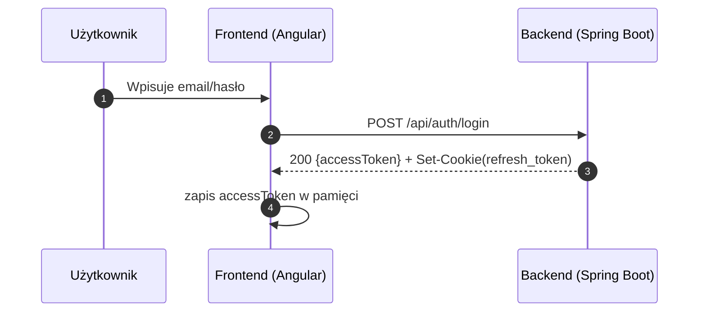
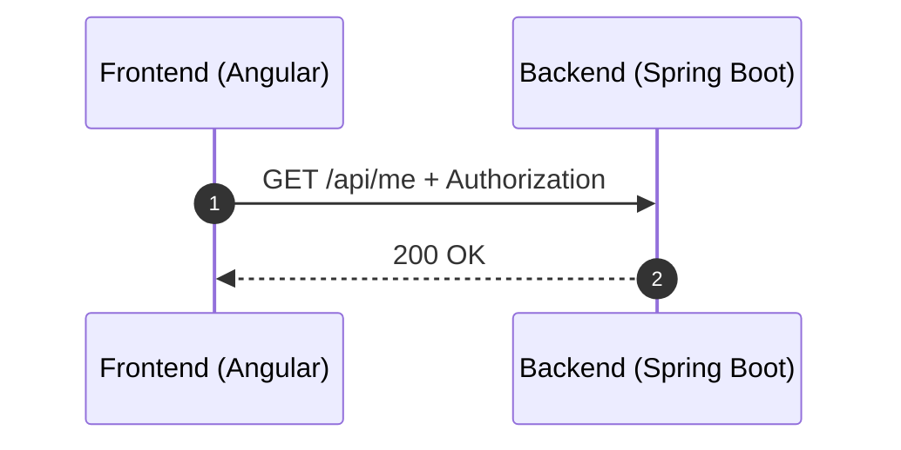
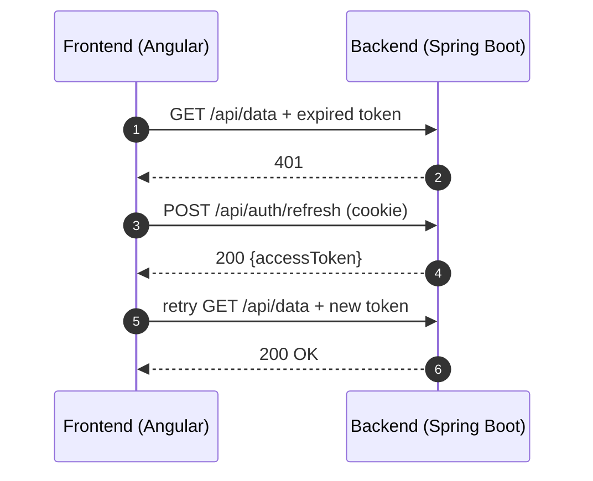

# Frontend — konspekt działania (Angular)

Frontend to aplikacja Angular, która:
- renderuje UI,
- komunikuje się z backendem przez REST (`/api/**`),
- obsługuje autoryzację w modelu: **JWT Access Token w pamięci + Refresh Token w HttpOnly cookie**.

> **Access token** jest przechowywany tylko w pamięci (nie w localStorage).  
> **Refresh token** jest w `HttpOnly` cookie — JavaScript go nie odczyta; przeglądarka wysyła go automatycznie (gdy `withCredentials: true`).

---

## 1. Główne elementy i odpowiedzialności

## 1.1 AuthService
Centralny serwis uwierzytelniania:
- przechowuje access token w pamięci (np. `BehaviorSubject<string | null>`),
- udostępnia metody:
  - `login(email, password)` — logowanie i zapis access token,
  - `silentRefresh()` / `refresh()` — pobranie nowego access token (przez refresh cookie),
  - `logout()` — wylogowanie (czyści token po stronie frontu + woła backend).

**Dlaczego token w pamięci?**
- mniejsze ryzyko kradzieży przez XSS niż localStorage,
- po odświeżeniu strony token znika → dlatego istnieje `silentRefresh()`.

---

## 1.2 authInterceptor (HttpInterceptor)
Interceptor odpowiada za:
- automatyczne dodawanie nagłówka:
  - `Authorization: Bearer <accessToken>`
    do requestów poza `/api/auth/**`,
- obsługę wygasłego tokena:
  - jeśli backend zwróci `401`, interceptor uruchamia `refresh`,
  - po udanym refresh ponawia pierwotny request z nowym tokenem.

---

## 1.3 Konfiguracja klienta HTTP / OpenAPI
Frontend używa klienta HTTP (często generowanego z OpenAPI). Kluczowe ustawienie:

- `withCredentials: true`

To powoduje, że przeglądarka wysyła cookie do backendu. Jest to wymagane dla:
- `POST /api/auth/refresh`
- `POST /api/auth/logout`

Bez `withCredentials` refresh będzie kończył się jak „brak sesji” (cookie nie zostanie wysłane).

---

## 2. Przepływy informacji

## 2.1 Logowanie
1. Użytkownik wpisuje dane i klika „Zaloguj”
2. Frontend wysyła: `POST /api/auth/login`
3. Backend zwraca:
  - `accessToken` w body
  - `Set-Cookie: refresh_token=...; HttpOnly`
4. Frontend zapisuje access token w pamięci

---

## 2.2 Wywołanie chronionego API
1. Komponent woła endpoint (np. `/api/me`)
2. Interceptor dodaje `Authorization: Bearer <accessToken>`
3. Backend zwraca dane (`200 OK`)

---

## 2.3 Wygasły access token → silent refresh
1. Request wraca `401 Unauthorized`
2. Interceptor wywołuje `POST /api/auth/refresh`
3. Backend zwraca nowy `accessToken`
4. Frontend zapisuje token i ponawia pierwotny request

---

## 2.4 Logout
1. Frontend wywołuje `POST /api/auth/logout`
2. Backend unieważnia refresh token i czyści cookie
3. Frontend czyści access token w pamięci

---

## 3. Diagramy sekwencji (Mermaid)

### 3.1 Login

### 3.2 Chroniony request

### 3.3 401 → refresh → retry

---

## 4. Dobre praktyki
- Nie zapisuj tokenów w `localStorage` ani `sessionStorage`
- Nie loguj tokenów w konsoli
- Stosuj single-flight refresh (jeden refresh request naraz)
- Przy cross-origin dopasuj politykę cookies (`SameSite`, `Secure`)
